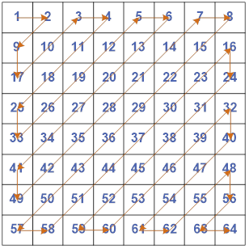
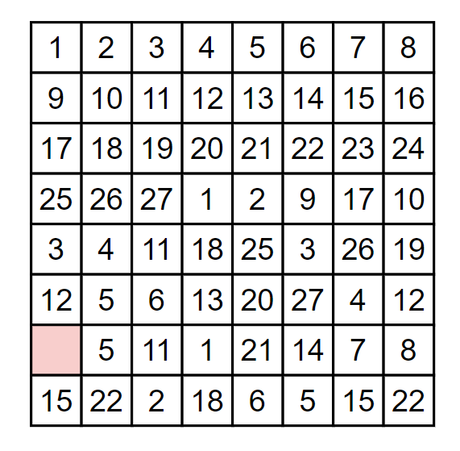

## ZigZag扫描

### 题目要求

如图所示，ZigZag扫描就是将8x8的矩阵块按照箭头运动方向重新排列（从1开始到64结束）：

设计一个时序逻辑电路，对输入64个整数（按照行优先方式构成8x8的矩阵块）按照ZigZag扫描方式依次输出。例如：

​	输入64个数据依次为：1, 2, 3, 4, ..., 61, 62, 63, 64

​	输出64个数据依次为：1, 2, 9, 17, 10, 3, ..., 62, 55, 48, 56, 63, 64

顶层模块名为**mat_scan**，输入输出功能定义：

| **名称** | **方向** | **位宽** | **描述**                 |
| -------- | -------- | -------- | ------------------------ |
| clk      | I        | 1        | 系统时钟                 |
| rst_n    | I        | 1        | 系统异步复位，低电平有效 |
| vld_in   | I        | 1        | 输入数据有效指示         |
| din      | I        | 10       | 输入数据                 |
| vld_out  | O        | 1        | 输出数据有效指示         |
| dout     | O        | 10       | 输出数据                 |

注：每组输入数据连续64个周期输入，即vld_in连续64个时钟周期有效；每组输出数据连续64个周期输出，即vld_out连续64个时钟周期有效。

 

**设计要求：**

* Verilog实现代码可综合，给出综合以及仿真结果。
* 使用SRAM缓存输入数据，SRAM使用bit数尽量少。
* 从数据输入到结果输出延迟周期数尽量少。

### 题目分析

要找到一个合适的点，使得这之后输入和输出可以并行，提前开始输出。

若输入数据到17时开始输出，则10个cycle后到zigzag扫描到25，此时输入数据已经到26，可以继续，但扫描到33时，输入数据还没到，因此不符合。

若输入数据到25时开始输出，则11个cycle后到zigzag扫描到33，此时输入数据已经到36，可以继续，再经过10个cycle，扫描到41时，输入数据到了46，但扫描到49时，输入数据还没到，因此不符合。

若输入数据到33时开始输出，则21个cycle后到zigzag扫描到41，此时输入数据已经到54，可以继续，再经过15个cycle，扫描到57时，输入数据只经过了3个cycle就到达57，符合要求，并且有裕量。

因此合适的时机在25-33之间，可以观察到，zigzag扫描到49是一个分水岭，要在扫到49时，刚好输入49。

扫描到49需要经过22个cycle，从49向前推22个cycle，即当输入到27时开始扫描输出，当扫描输出到49时，刚好输入也到达49，在这之后扫描输出就跟不上输入了，符合要求。

基于以上，除了第49个数不用存储，其他的数据都需要存。题目要求用SRAM，理论上，当第27个输入数据后，每扫描出一个数据，新输入的数据就可以存入该地址，因此第28个数据可以存在扫描输出1的地址，29存在2的地址，30存在9的地址，以此类推，因此SRAM需要的大小为，27 * 10bit。

如图为输入数据存储的寻址顺序，前27个数据顺序地址存储，地址从1-27，第28个数存储到地址1，这之后按照地址序列[1,2,9,17,10,3,4,11,18,25,...,15,22]进行存储，注意红色方块位置（即上文中49的位置）比较特殊，这个时候输出直连输入，不需要存储。

同时，地址序列[1,2,9,17,10,3,4,11,18,25,...,15,22]也是zigzag扫描寻址的序列的前半部分，后半部分为[11,13,25,9,23,16,24,17,3,20,1,2,18,21,27,26,10,19,4,14,6,5,7,12,8,15,22]。

**总结：**

我们需要设置一个64个元素的地址序列，首先按顺序依次将输入的前27个数据存入，第28个cycle开始按照地址序列进行寻址输出，同时将输入数据写入，直到所有地址序列寻址完成。

### 硬件要求

由于需要在同一个cycle读出数据和写入数据，需要双端口SRAM。
