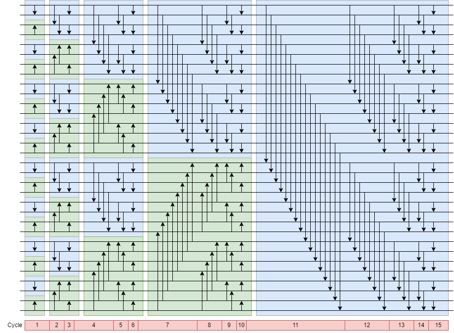

## Bitonic Sorter（双调排序）

参考文章：

[冒泡、归并、双调排序的GPU实现_sort 算法 gpu 实现-CSDN博客](https://blog.csdn.net/lixiaoguang20/article/details/77987826)

[三十分钟理解：双调排序Bitonic Sort，适合并行计算的排序算法-CSDN博客](https://blog.csdn.net/xbinworld/article/details/76408595)

[Bitonic sorter - Wikipedia](https://en.wikipedia.org/wiki/Bitonic_sorter)

### 算法选择

1. 并行冒泡排序：时间复杂度O(n)，空间复杂度 O(n^2)

2. 双调排序：时间复杂度 O((logn)^2)，空间复杂度O(n*(logn)^2)

对于32个输入的排序模块，n=16，两种算法都需要15cycle，8个比较器。如果输入再多一些，双调排序优势就比较明显了。

在硬件实现上，并行冒泡排序只有奇偶交替两种情况，比较器输入的mux结构简单，面积小；双调排序的数据流的传递情况更多，面积应该大一些。

这里并行冒泡排序合适一些，不过还是写一下双调排序。

### 算法实现



每个箭头是一个比较器，蓝色表示这是一个降序序列，绿色表示升序序列，蓝绿一组为双调序列，详见参考文章2。

### Feature:

1. 输入打一拍，组合逻辑直接输出
2. 延时15 cycle
3. 16个数值比较器


### 综合报告

#### 500M 面积报告
```
------------------------------

                                  Global cell area          Local cell area
                                  ------------------  ---------------------------- 
Hierarchical cell                 Absolute   Percent  Combi-     Noncombi-  Black-
                                  Total      Total    national   national   boxes   Design
--------------------------------  ---------  -------  ---------  ---------  ------  ---------
sort_32_u8                        3418.3926    100.0  2407.6458  1010.7468  0.0000  sort_32_u8
--------------------------------  ---------  -------  ---------  ---------  ------  ---------
Total                                                 2407.6458  1010.7468  0.0000
```

